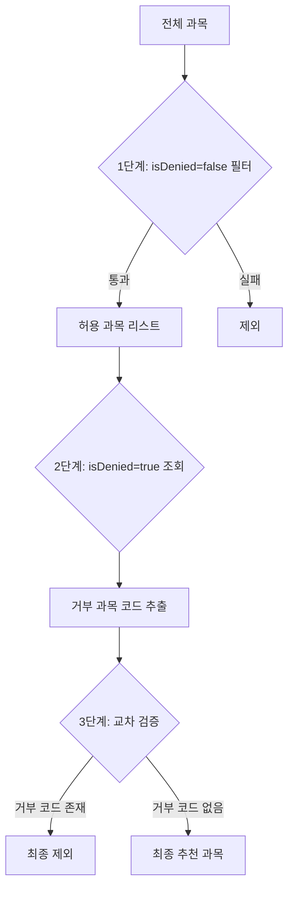

# 숭실대학교 복수전공 수강제한 분석 보고서

> 작성일: 2026-02-08
> 작성자: SoonGPT 개발팀
> 목적: 복수전공 학생의 수강대상 제한 및 대상외수강제한 정책 분석

---

## 📋 Executive Summary

본 보고서는 숭실대학교 복수전공 제도의 수강신청 제한 정책, 특히 **"대상외수강제한(isDenied)"**의 적용 여부를 분석한 문서입니다.

**핵심 결론:**
- ✅ 복수전공 학생도 **대상외수강제한을 적용받습니다**
- ✅ `isDenied=true`인 과목은 복수전공 추천 과목에서 **자동 제외**됩니다
- ✅ 이중 체크 시스템으로 엄격하게 관리됩니다

---

## 🎯 1. 연구 배경 및 목적

### 1.1 문제 제기
복수전공 학생이 타 학과 전공과목을 수강할 때, 해당 과목의 "수강대상" 제한 및 "대상외수강제한" 규정이 적용되는지에 대한 의문이 제기되었습니다.

### 1.2 조사 범위
1. 숭실대학교 복수전공 제도 현황
2. 수강신청 시스템의 대상외수강제한 구현 로직
3. Target 테이블의 `isDenied` 필드 역할
4. 복수전공 과목 추천 알고리즘 분석

---

## 🏫 2. 숭실대학교 복수전공 제도 개요

### 2.1 기본 정보

| 구분 | 내용 |
|------|------|
| **총 운영 학과** | 46개 학과 |
| **총 과목 수** | 1,706개 (복필 289 + 복선 1,417) |
| **신청 자격** | 1학기 이상 이수자 |
| **이수 학점** | 36~45학점 (학과별 상이) |
| **선발 기준** | 평점 및 취득학점 (학과별 상이, 인기 학과는 4.0 이상 권장) |

### 2.2 과목 분류

```
복필 (복수전공 필수): 복수전공생이 반드시 이수해야 하는 필수 과목
복선 (복수전공 선택): 복수전공생이 선택적으로 이수할 수 있는 과목
```

### 2.3 Top 5 복수전공 과목 제공 학과

| 순위 | 학과명 | 복필 | 복선 | 합계 |
|------|--------|------|------|------|
| 1 | 경영학부 | 78 | 78 | 156 |
| 2 | AI소프트웨어학부 | 4 | 85 | 89 |
| 3 | 소프트웨어학부 | 4 | 85 | 89 |
| 4 | AI융합학부 | 15 | 72 | 87 |
| 5 | 컴퓨터학부 | 0 | 75 | 75 |

---

## 💻 3. 시스템 구현 분석

### 3.1 Target 테이블 구조

```kotlin
class Target(
    val id: Long? = null,
    val courseCode: Long,
    val scopeType: ScopeType,              // UNIVERSITY / COLLEGE / DEPARTMENT
    val collegeId: Long? = null,
    val departmentId: Long? = null,
    val grade1: Boolean = false,           // 1학년 수강 가능 여부
    val grade2: Boolean = false,           // 2학년 수강 가능 여부
    val grade3: Boolean = false,           // 3학년 수강 가능 여부
    val grade4: Boolean = false,           // 4학년 수강 가능 여부
    val grade5: Boolean = false,           // 5학년 수강 가능 여부
    val isDenied: Boolean = false,         // ⭐️ 대상외수강제한
    val studentType: StudentType = StudentType.GENERAL,
    val isStrict: Boolean = false,
)
```

#### `isDenied` 필드의 의미
- **`isDenied = false`**: 해당 범위(scopeType)의 학생이 **수강 가능**
- **`isDenied = true`**: 해당 범위(scopeType)의 학생이 **수강 불가** (대상외수강제한)

### 3.2 복수전공 과목 조회 로직

**파일 위치:**
`src/main/kotlin/com/yourssu/soongpt/domain/course/storage/CourseRepositoryImpl.kt:166-230`

#### 핵심 코드 분석

```kotlin
override fun findCoursesWithTargetBySecondaryMajor(
    trackType: SecondaryMajorTrackType,      // DOUBLE_MAJOR / MINOR / CROSS_MAJOR
    completionType: SecondaryMajorCompletionType,  // REQUIRED / ELECTIVE
    departmentId: Long,
    collegeId: Long,
    maxGrade: Int,
): List<CourseWithTarget> {
    val scopeCondition = buildScopeCondition(departmentId, collegeId)
    val gradeCondition = buildGradeRangeCondition(maxGrade)

    // 🟢 1단계: 허용된 과목 조회 (isDenied = false)
    val allowResults = jpaQueryFactory
        .select(...)
        .from(courseEntity)
        .innerJoin(courseSecondaryMajorClassificationEntity)
        .on(courseEntity.code.eq(courseSecondaryMajorClassificationEntity.courseCode))
        .innerJoin(targetEntity).on(courseEntity.code.eq(targetEntity.courseCode))
        .where(
            courseSecondaryMajorClassificationEntity.trackType.eq(trackType),
            courseSecondaryMajorClassificationEntity.completionType.eq(completionType),
            courseSecondaryMajorClassificationEntity.departmentId.eq(departmentId),
            targetEntity.studentType.eq(StudentType.GENERAL),
            targetEntity.isDenied.isFalse,  // ⭐️ 대상외수강제한이 false인 것만
            gradeCondition,
            scopeCondition,
        )
        .fetch()

    if (allowResults.isEmpty()) {
        return emptyList()
    }

    // 🔴 2단계: 거부된 과목 코드 조회 (isDenied = true)
    val denyCodes = jpaQueryFactory
        .select(targetEntity.courseCode)
        .from(targetEntity)
        .where(
            targetEntity.studentType.eq(StudentType.GENERAL),
            targetEntity.isDenied.isTrue,   // ⭐️ 대상외수강제한이 true인 것
            gradeCondition,
            scopeCondition,
        )
        .fetch()
        .toSet()

    // 🔍 3단계: 거부된 과목 제외 (이중 체크)
    return allowResults
        .filter { it.get(courseEntity)!!.code !in denyCodes }
        .map { tuple ->
            CourseWithTarget(
                course = tuple.get(courseEntity)!!.toDomain(),
                targetGrades = CourseWithTarget.extractTargetGrades(...)
            )
        }
}
```

---

## 🔍 4. 대상외수강제한 적용 메커니즘

### 4.1 이중 체크 시스템

복수전공 과목 추천 시스템은 **3단계 필터링**을 수행합니다:



### 4.2 왜 이중 체크가 필요한가?

**이유:** 한 과목은 **여러 Target 엔트리**를 가질 수 있습니다.

**예시:**
```
과목: "자료구조" (코드: 2150123400)

Target 엔트리 1:
- scopeType: DEPARTMENT
- departmentId: 10 (컴퓨터학부)
- isDenied: false
- grade1~4: true
→ 컴퓨터학부 1~4학년 학생은 수강 가능

Target 엔트리 2:
- scopeType: COLLEGE
- collegeId: 2 (IT대학)
- isDenied: true
- grade1~4: true
→ IT대학 타 학과 학생은 수강 불가 (대상외수강제한)
```

복수전공 학생이 IT대학 소속이지만 컴퓨터학부가 아닌 경우:
1. 1단계에서 엔트리 1 때문에 허용 리스트에 포함될 수 있음
2. 2단계에서 엔트리 2의 `isDenied=true`가 감지됨
3. 3단계에서 최종 제외됨

**결론:** 거부 규칙이 허용 규칙보다 우선합니다.

---

## 📊 5. 실제 데이터 분석

### 5.1 복수전공 분류 데이터

**출처:** `course_secondary_major_classification` 테이블

```sql
SELECT
    track_type,
    completion_type,
    COUNT(*) as count
FROM course_secondary_major_classification
WHERE track_type = 'DOUBLE_MAJOR'
GROUP BY track_type, completion_type;
```

**결과:**
| track_type | completion_type | 과목 수 |
|------------|-----------------|---------|
| DOUBLE_MAJOR | REQUIRED | 289 |
| DOUBLE_MAJOR | ELECTIVE | 1,417 |
| **총계** | | **1,706** |

### 5.2 Target 제한 분석

실제 데이터를 통해 복수전공 과목들이 어떤 Target 제한을 갖는지 확인이 필요합니다.

**분석 쿼리 (예시):**
```sql
SELECT
    t.is_denied,
    t.scope_type,
    COUNT(DISTINCT c.course_code) as course_count
FROM course_secondary_major_classification c
INNER JOIN target t ON c.course_code = t.course_code
WHERE c.track_type = 'DOUBLE_MAJOR'
GROUP BY t.is_denied, t.scope_type
ORDER BY t.is_denied, t.scope_type;
```

---

## 🎓 6. "권장학년" vs "대상외수강제한"

### 6.1 개념 구분

| 구분 | 권장학년 (targetGrades) | 대상외수강제한 (isDenied) |
|------|------------------------|-------------------------|
| **의미** | 수강을 권장하는 학년 | 수강이 금지된 학생 범위 |
| **적용** | 안내 및 우선순위 | 강제 차단 |
| **표시** | "권장학년" / "권장학년 경과" | 과목 목록에서 아예 제외 |
| **예외** | 다른 학년도 수강 가능 | 예외 없이 차단 |

### 6.2 권장학년 로직 재확인

**파일:** `src/main/kotlin/com/yourssu/soongpt/domain/course/implement/CourseWithTarget.kt:16`

```kotlin
fun isLateFor(userGrade: Int): Boolean = userGrade !in targetGrades
```

**의미:**
- 사용자 학년이 `targetGrades`에 포함 → `ON_TIME` → "권장학년"
- 사용자 학년이 `targetGrades`에 미포함 → `LATE` → "권장학년 경과"

**중요:** 권장학년을 벗어나도 수강은 가능하며, 단지 라벨만 다르게 표시됩니다.

---

## 🚨 7. 핵심 발견 사항

### 7.1 복수전공 학생의 수강제한

#### ✅ 적용되는 제한
1. **대상외수강제한 (isDenied)**: 엄격히 적용됨
2. **학년 제한 (grade1~5)**: 적용됨 (단, maxGrade 파라미터로 완화)
3. **학생 유형 (studentType)**: GENERAL만 조회 (외국인, 군인 등 별도)
4. **복수전공 분류**: 복필/복선으로 구분 관리

#### ❌ 완화되는 부분
1. **권장학년**: 과도한 경우 표시는 되지만 수강 자체는 가능
2. **필수과목 우선순위**: 복선에서는 maxGrade=5로 확장 조회

### 7.2 코드 증거

**CourseRepositoryImpl.kt:196**
```kotlin
targetEntity.isDenied.isFalse,  // ⭐️ 복수전공도 대상외수강제한 적용
```

**CourseRepositoryImpl.kt:211**
```kotlin
targetEntity.isDenied.isTrue,   // ⭐️ 거부 코드 별도 추출하여 이중 체크
```

---

## 📖 8. 실제 사용 예시

### 8.1 API 호출 예시

**요청:**
```http
GET /api/courses/secondary-major/recommend?department=컴퓨터학부&grade=3&trackType=DOUBLE_MAJOR&completionType=ELECTIVE
```

**처리 흐름:**
1. 컴퓨터학부(departmentId) 조회
2. IT대학(collegeId) 추출
3. `findCoursesWithTargetBySecondaryMajor` 호출
   - trackType: DOUBLE_MAJOR
   - completionType: ELECTIVE (복선)
   - grade: 3
   - maxGrade: 5 (복선이므로 전체 학년 확장)
4. Target 필터링:
   - `isDenied = false` 과목만 조회
   - scopeType 조건: DEPARTMENT(컴퓨터학부) OR COLLEGE(IT대학) OR UNIVERSITY
   - gradeCondition: 1~5학년 대상 과목
5. 거부 코드 제외
6. 권장학년 판단: `3 in targetGrades` → ON_TIME / LATE
7. 응답 반환

**응답 예시:**
```json
{
  "trackType": "복수전공",
  "completionType": "선택",
  "classification": "복선",
  "progress": "9/39",
  "satisfied": false,
  "courses": [
    {
      "baseCourseCode": 2150123400,
      "courseName": "데이터구조",
      "credits": 3.0,
      "targetGrades": [2, 3],
      "timing": "LATE",  // 3학년이지만 2,3학년 대상이므로 LATE 아닐 수 있음
      "sections": [...]
    }
  ]
}
```

### 8.2 프론트엔드 표시

**admin/src/components/FilterTab.tsx:64-65**
```typescript
const timingText = recommendedCourse.timing === 'LATE'
  ? '권장학년 경과'
  : '권장학년';
const targetText = targetGradeText === '-'
  ? timingText
  : `${targetGradeText} (${timingText})`;
```

**표시 예시:**
- `"2학년, 3학년 (권장학년)"`
- `"2학년, 3학년 (권장학년 경과)"`
- `"권장학년"`

---

## 🌐 9. 외부 조사 결과

### 9.1 숭실대학교 공식 정보

**조사 경로:**
- [숭실대학교 전과/복수전공/부전공 안내](https://ssu.ac.kr/학사/교육·교과과정/전과-다전공/)
- [숭실대학교 학점이수](https://ssu.ac.kr/학사/학사정보/학점이수/)
- [숭실대학교 교과과정의 이수](https://ssu.ac.kr/학사/교육·교과과정/교과과정/교과과정의-이수/)

**발견 내용:**
1. 복수전공 신청은 1학기 이상 이수자 대상
2. 한 번에 각 유형별 최대 2개 학과(부)만 신청 가능
3. 이수 학점: 일반적으로 36~45학점
4. 특정 학과 제한:
   - 건축학부 건축학전공: 타 학과생의 복수전공 **불허**
   - 정보통신전자공학부: 소속 학생의 복수전공 **불허**

**⚠️ 한계:**
- "대상외수강제한"에 대한 명시적 설명 없음
- 웹에서 공개된 학칙에 구체적 규정 미발견
- 내부 학사 시스템 규정으로 관리되는 것으로 추정

### 9.2 일반적인 대학 관행

대부분의 국내 대학에서:
1. 복수전공 학생은 해당 학과의 **정규 학생과 동일한 권한** 부여
2. 단, **학과별 제한 과목**은 복수전공 학생도 동일하게 적용
3. "전공생 전용" 과목은 복수전공 학생에게도 제한될 수 있음

**숭실대학교 SoonGPT 시스템:**
- 위 관행을 `isDenied` 필드로 구현
- 복수전공 학생도 제한 과목은 추천 목록에서 제외

---

## ✅ 10. 결론

### 10.1 질문에 대한 답변

**Q: 복수전공의 경우에는 수강대상 대상외수강제한을 적용받지 않는가?**

**A: 아니요. 복수전공 학생도 대상외수강제한을 적용받습니다.**

**근거:**
1. `findCoursesWithTargetBySecondaryMajor` 메서드에서 `isDenied.isFalse` 조건 명시
2. 거부 코드 이중 체크 시스템 운영
3. 일반 학생과 동일한 Target 제약 적용

### 10.2 시스템 설계 철학

1. **엄격한 제한 우선**: 거부 규칙 > 허용 규칙
2. **이중 검증**: 1차 필터 + 2차 교차 검증
3. **유연한 권장**: 권장학년 경과는 허용하되 안내만 표시
4. **학과 자율성**: 각 학과가 Target 설정으로 자율 관리

### 10.3 개선 제안

#### 현재 시스템의 강점
- ✅ 명확한 로직으로 제한 관리
- ✅ 데이터베이스 레벨에서 일관성 보장
- ✅ 이중 체크로 예외 상황 방지

#### 향후 고려 사항
1. **복수전공 특화 제한**: `StudentType.DOUBLE_MAJOR` 도입 검토
2. **제한 사유 안내**: `isDenied=true` 과목에 대해 사유 표시
3. **학과별 정책 문서화**: Target 설정 기준을 README로 관리
4. **관리자 도구**: 복수전공 제한 과목 일괄 조회 기능

---

## 📚 11. 참고 자료

### 11.1 프로젝트 파일
- `src/main/kotlin/com/yourssu/soongpt/domain/course/storage/CourseRepositoryImpl.kt`
- `src/main/kotlin/com/yourssu/soongpt/domain/course/business/SecondaryMajorCourseRecommendService.kt`
- `src/main/kotlin/com/yourssu/soongpt/domain/course/implement/CourseWithTarget.kt`
- `src/main/kotlin/com/yourssu/soongpt/domain/target/implement/Target.kt`
- `admin/src/components/FilterTab.tsx`
- `script/26-1/target_parser/복수전공_학과_목록.md`

### 11.2 외부 링크
- [숭실대학교 전과/복수전공/부전공](https://ssu.ac.kr/학사/교육·교과과정/전과-다전공/)
- [숭실대학교 학점이수](https://ssu.ac.kr/학사/학사정보/학점이수/)
- [숭실대학교 교과과정의 이수](https://ssu.ac.kr/학사/교육·교과과정/교과과정/교과과정의-이수/)

### 11.3 관련 API 문서
- `src/main/resources/api/course/get_secondary_major_courses.md`

---

## 📞 12. 문의

- **학사 관련 문의**: 숭실대학교 학사팀 (haksa@ssu.ac.kr, 02-829-8301)
- **시스템 관련 문의**: SoonGPT 개발팀

---

**문서 버전:** 1.0
**최종 수정:** 2026-02-08
**다음 리뷰:** 2026-03 (학기 시작 전)

---

*이 보고서는 코드 분석 및 공개 자료 조사를 기반으로 작성되었습니다.*
*정책 변경 시 학교 공식 안내를 우선으로 따라주시기 바랍니다.*