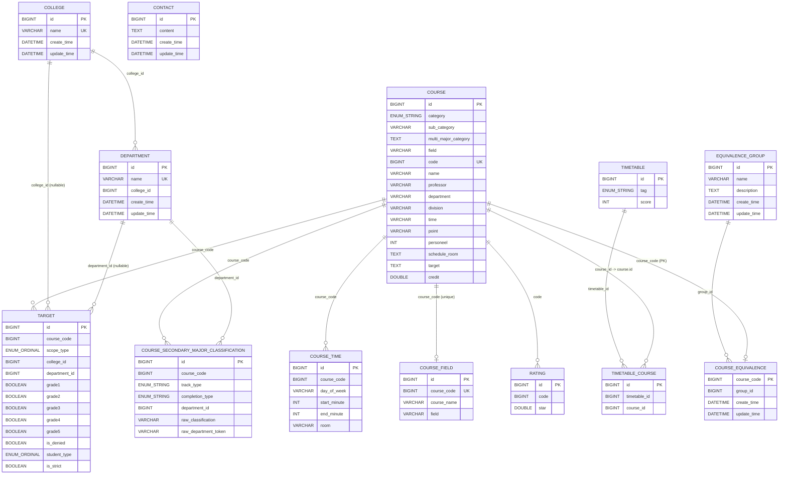

# Backend DB ERD

`src/main/kotlin/com/yourssu/soongpt/domain/**/storage/*Entity.kt` 기준으로 정리한 ERD입니다.

## 제약조건 메모

- `course.code`는 유니크입니다.
- `course_field.course_code`는 유니크여서 과목당 field 레코드는 최대 1개입니다.
- `course_secondary_major_classification`은 `(course_code, track_type, completion_type, department_id)` 복합 유니크 제약이 있습니다.
- `course_equivalence.course_code`가 PK이므로 과목은 최대 하나의 equivalence group에 속합니다.
- `target.college_id`, `target.department_id`는 nullable이며 `scope_type` 조합으로 의미가 결정됩니다.
- `college`, `department`, `equivalence_group`, `course_equivalence`, `contact`는 감사 컬럼(`create_time`, `update_time`)을 가집니다.
