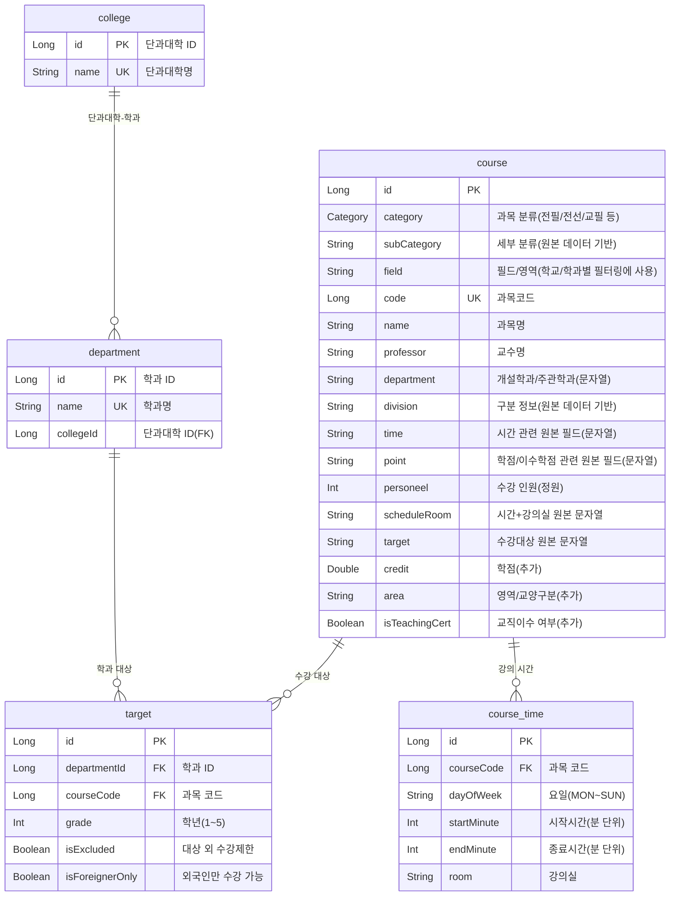

# ERD: Proposed Schema (aligned with backend names)

## Index Notes

- Recommended (DB): `INDEX (department_id, grade, course_code)` for `WHERE department_id=? AND grade=?` + `SELECT course_code` (covering)
- Maps to (entity): `TargetEntity.departmentId`, `TargetEntity.grade`, `TargetEntity.courseCode`

- Recommended (DB): `INDEX (course_code)` for `course_time` lookup by course
